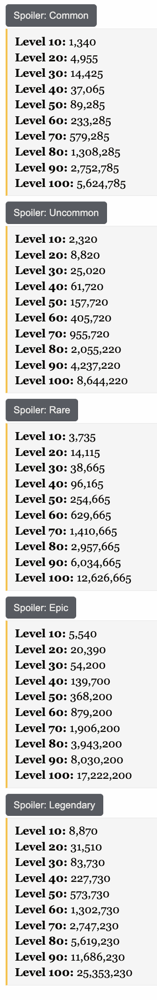

# Hypixel Scripts

This is a collection of scripts you can use in hypixel to improve your experience in the game. 

This is a collection of scripts i've made so that you can automate things in mostly hypixel skyblock

# Quarry [Link](https://github.com/barneygale/quarry)

Quarry is a minecraft packet module that read the packets that come into minecraft. 
This works by creating another dummy minecraft server and sents the packet that you send it to the original server and any packets that it gets to you. 
Then, you can intercept the packets coming though the servers using these python scripts. 
By doing this I made a litelle movement client that allows you to fly

Warning: Please use with caution and would not be adviesd to use on hypixel as you WILL get banned. 
Warning: Also, I only made this as a proof of concept so theres no way this wouldn't get caught by the hypixel anti-cheat. 

# How to use

This is the easiest part of this! 
All you have to do is launch minecraft and run the scripts. You have a few seconds to position yourself for the farm skripts and the other scripts you don't even need minecraft for!
Since it uses the hypixel api and need the auction data and not the client. 

# How to add on the projects 

These projects are mostly not interconnected expect for the pet scripts. 
The projects uses key inputs to move around the player for the farm program and the dancing program. 

The pet projects are the core of this which have 2 main functions:
- The caching functions
  - There are 2 of these which one, creates the quick caches which creates threads for each call of the ah items
  - Then there is the normal one which goes through them all
    - The advantage to this is that there wont's be any skipping if theres an update to the ap mid api call
- Graphing the pet functions
  - These functions find the pet score by their exp number and their price
  - Them find the slope of the graph by finding the lowest prices max level pet and the lowest price low exp pet
